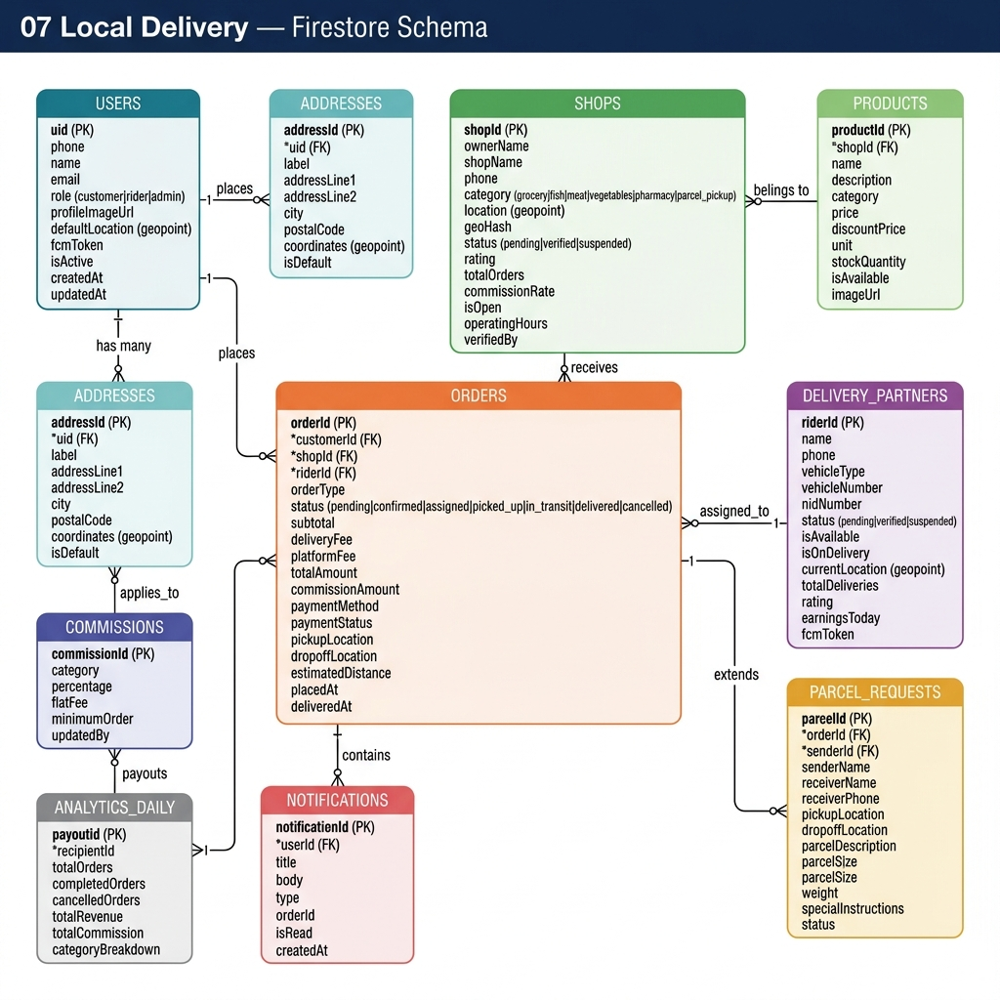
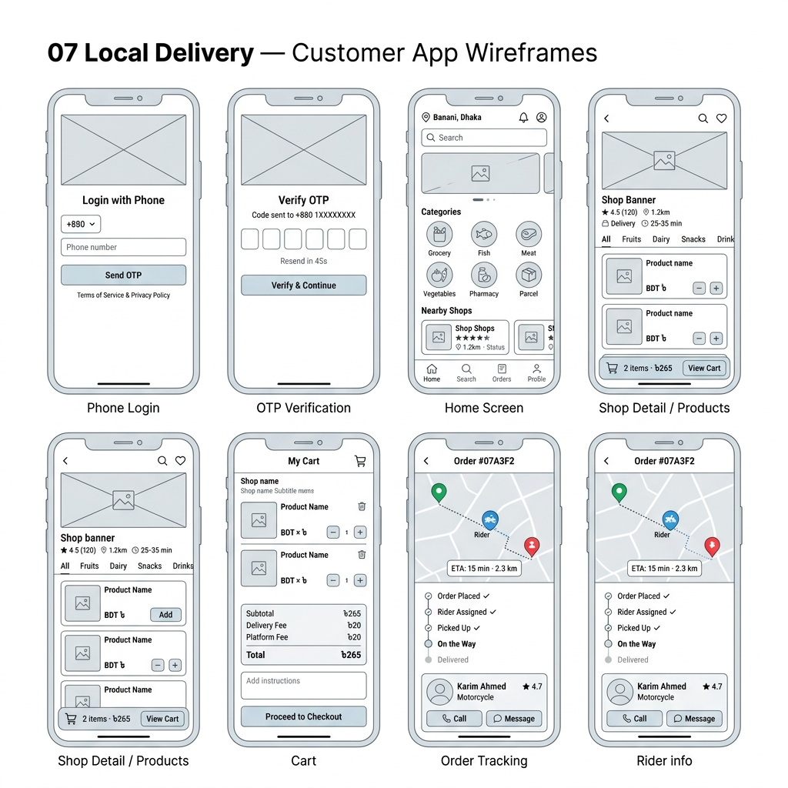
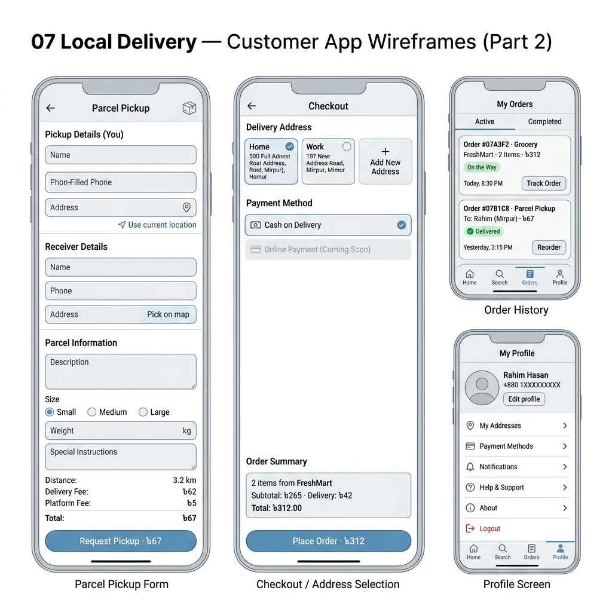
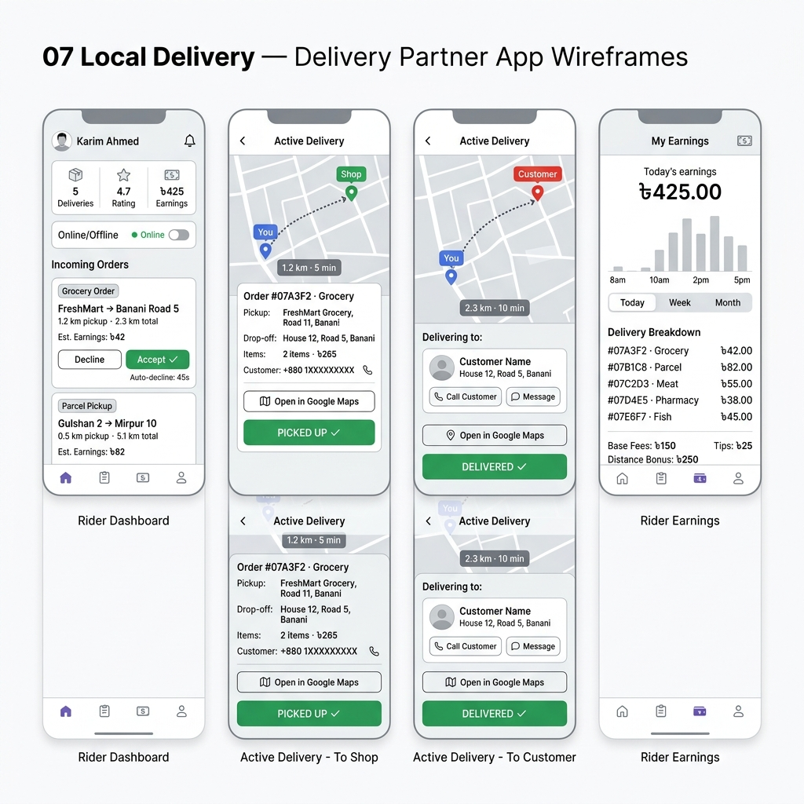
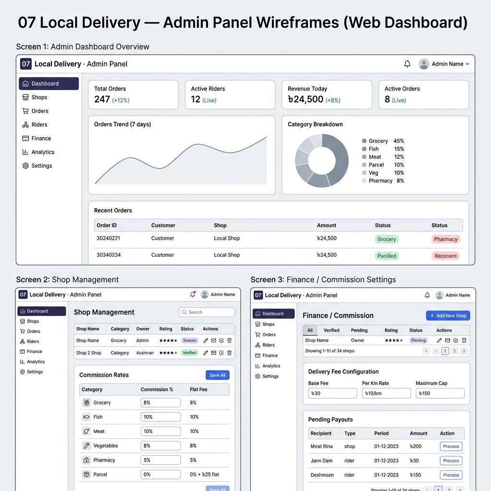

# 07 Local Delivery
**Name:** Mahmud Mostofa Al Maruf  
**Student ID:** 22101132  
**Course:** CSE489 - Android App Development  

---

## 📌 Project Overview
**07 Local Delivery** is a specialized hyperlocal platform designed to bridge the gap between small-town vendors and local residents. Unlike generic delivery apps, this system focuses on essential daily commodities like **grocery, fish, meat, vegetables, and pharmacy items**, ensuring fresh delivery from the nearest trusted shops. 

Beyond standard commerce, the app features a unique **Parcel Pickup** service, allowing users to move personal items across the city with real-time tracking. Built with a focus on scalability and role-based logistics, it empowers local businesses through a dedicated vendor ecosystem and a streamlined delivery partner network.

---

## 🚀 Milestone 2: Technical Implementation Breakdown

### 1. Firebase Integration & Architecture
- **Authentication:** Integrated **Firebase Phone Auth** with OTP logic, supporting both production SMS and Firebase Testing numbers for seamless demo environments.
- **Database Design (Firestore):** Developed a scalable NoSQL schema using `users`, `shops`, and `orders` collections. Utilized **sub-collections** for product inventory to ensure a normalized and query-efficient structure.
- **State Management:** Implemented **Provider (ChangeNotifier)** architecture to decouple business logic from the UI. Logic flows from dedicated services (`AuthService`, `ShopService`) to global providers.

### 2. User Roles & Intelligent Routing
- **Role-Based Access Control (RBAC):** Distinct workflows for `customer` and `rider` roles.
- **Dynamic Navigation:** Post-verification, the app fetches the User document and intelligently routes the user to the correct dashboard based on their registered role.

### 3. Customer Ecosystem & Cart Logic
- **Live Inventory:** Data is fetched in real-time from Cloud Firestore, ensuring zero hardcoded shop/product data.
- **Strict Single-Vendor Cart:** Implemented logic to restrict orders to one shop at a time to simplify delivery logistics. Adding items from a new shop triggers a cart reset prompt.
- **Atomic Batch-Writes:** Integrated `submitOrder()` using atomic operations. The main order and all its sub-items are written to Firestore simultaneously to prevent data corruption.

### 4. Technical Challenges & Edge Cases Solved
- **Index Optimization:** Designed local Dart-side sorting (e.g., for `rating` or `placedAt`) to bypass Firebase's complex composite index requirements (`FAILED_PRECONDITION`).
- **Exception Mapping:** Mapped Firebase backend exceptions to user-friendly UI SnackBars for clear feedback.
- **Build System Fix:** Resolved Windows-Android build chain crashes by disabling `kotlin.incremental` caching.

---

## 🚀 Milestone 1: Database Schema & UI Wireframes

---

## 📊 1. Database Schema (Firestore)
The system uses a structured NoSQL database schema designed for real-time order tracking, hyperlocal shop discovery, and detailed commission management.

---

## 🎨 2. UI Wireframes
Detailed layouts for Customer, Rider, and Admin interfaces showcasing the end-to-end user journey.

### A. Customer Application
Focuses on ease of ordering, category-based shop browsing (Grocery, Pharmacy, etc.), and live GPS tracking on a map.

### B. Delivery Partner (Rider) App
Designed for quick order acceptance, real-time navigation updates, and transparent earnings tracking.

### C. Admin Web Dashboard
A comprehensive panel for onboarding vendors, setting commission rates, and monitoring daily sales analytics.

---

## 🛠️ Project Scope & Key Features
- **OTP Auth:** Mobile number login via Firebase Authentication.
- **Hyperlocal Shop Discovery:** Fetching shops based on user coordinates.
- **Real-time Tracking:** Live GPS synchronization between Rider and Customer.
- **Order Management:** Support for both standard shopping and **Parcel Pickup** services.
- **Admin Control:** Role-based access for managing the entire delivery ecosystem.
